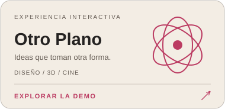

<div align="center">

# Otro Plano

### Diseño, movimiento y una pequeña dosis de lo improbable.

Una experiencia web para un estudio creativo: tipografía expresiva, una escultura 3D interactiva y una sala de cine experimental.

**[Explorar la demo ↗](https://pablo2611.github.io/otro-plano/)** · [Ver el código](https://github.com/pablo2611/otro-plano)

<a href="https://pablo2611.github.io/otro-plano/"></a>

**Next.js · React · TypeScript · Three.js**

</div>

## La experiencia

- **Materia interactiva.** Escultura generativa en 3D: arrastra para girarla o cambia su material y color.
- **Archivo vivo.** Proyectos con imágenes, fichas y relatos que se abren sin salir de la página.
- **Sala de cine.** Cuatro films con música ambiental original, reproducción, pantalla completa y efectos de intensidad. Activa la música desde el botón del reproductor; se pausa y se sincroniza con el vídeo.
- **Diseño adaptable.** Navegación móvil, acceso por teclado y respeto por la preferencia de movimiento reducido.

## Ejecutar en local

```sh
npm ci
npm run dev
```

Abre [localhost:3000](http://localhost:3000).

## Publicación

Cada cambio en `main` compila y publica el sitio en GitHub Pages mediante [GitHub Actions](.github/workflows/pages.yml). La exportación es estática y no requiere una base de datos.

```sh
# macOS / Linux
NEXT_PUBLIC_BASE_PATH=/otro-plano npm run build
```

```powershell
# PowerShell
$env:NEXT_PUBLIC_BASE_PATH = '/otro-plano'
npm run build
```

Los archivos publicados se generan en `out/`.

## Créditos y material visual

Proyecto adaptado a partir del ZIP proporcionado. Los vídeos conservan los créditos y enlaces a sus autores en Pexels dentro de la sala de cine. Las tres imágenes de proyectos no estaban incluidas en el ZIP; se reemplazaron por carteles de ese mismo material audiovisual.

La banda sonora «Materia» es una composición instrumental sintetizada para este proyecto. Se sirve desde `public/audio/materia.mp3`, sin depender de servicios externos de música.
